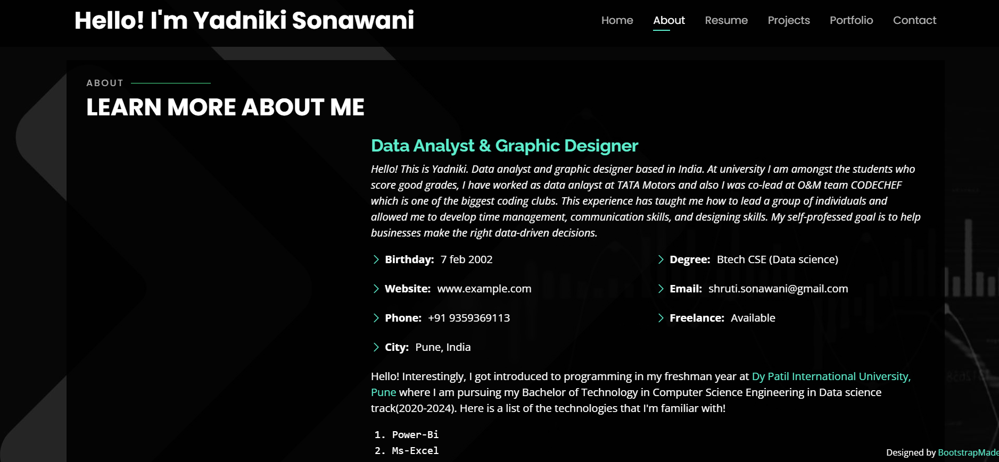

# yadniki.github.io
# Personal Portfolio 🔥
> (https://yadnikis.github.io/yadniki.github.io/)

:star: Star me on GitHub — it helps!

### Website Preview
#### Home Page

#### About Page

#### Projects Page

  

:star: Star me on GitHub — it helps!

## Features 📋
• Fully Responsive\
• Valid HTML5 & CSS3\
• Easy to modify\

## Installation & Deployment 📦
- Clone the repository and modify the content of <b>index.html</b> 
- Add or remove images from `assets/img/` directory as per your requirement.
- Update the info of `projects` folder according to your need
- Use [Github Pages](https://create-react-app.dev/docs/deployment/#github-pages) to create your own website.
- To deploy your website, first you need to create github repository with name `<your-github-username>.github.io` and push the generated code to the `master` branch.

## Sections 📚
✔ Home\
✔ About\
✔ Resume\
✔ Projects\
✔ Portfolio\
✔ Contact \

## Tools Used 🛠️
* <b>GitHub Pages</b> - To host my static website (HTML, CSS, JS).
